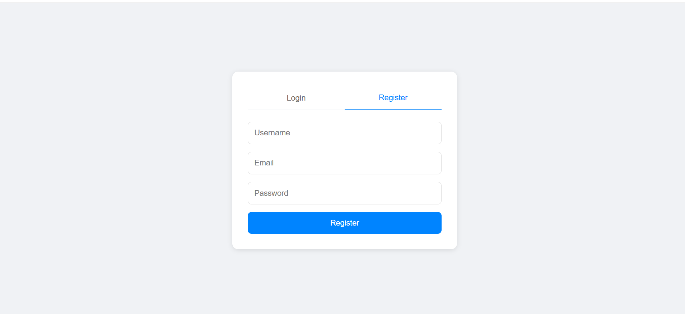
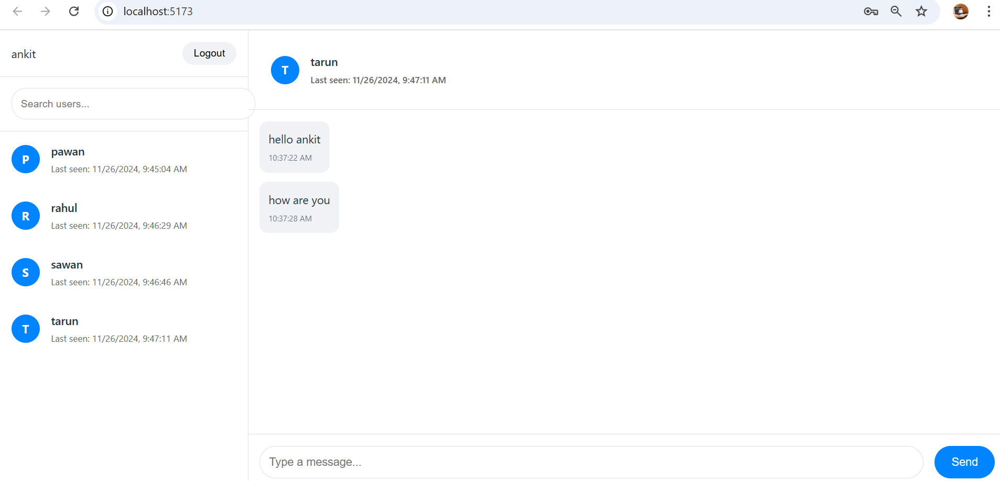

<h1>Welcome to ChatApp</h1>

In this web application. I have used mqtt third party lib for chat purpose. here in this application user can send message to the user.
and the see the message if user message him. here we can search the users as well. and login and logout or register functionality also added.

<h3>Below are the Some Image related to ChatApp please check that</h3>

<h3>Let's talk about how to run this web application</h3>

<ul>
    <li>First ensure that you installed in your system mongodb, node js, as well</li>
    <li>Afther that run `npm install` command in chatapp directory</li>
    <li>then run the command `npm run dev` this is for client</li>
    <li>then run the command `npm run server` this is for server</li>
</ul>